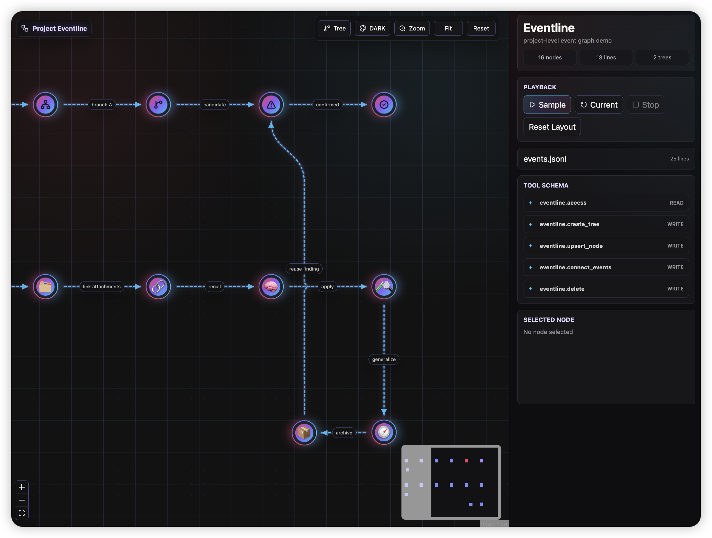

# An implementation of event line graph for agentic system, through MCP protocol.

<p align="center">
  <a href="https://modelcontextprotocol.io/"></a>
  <a href="https://react.dev/"></a>
  <a href="https://vite.dev/"></a>
  <br>
  <a href="https://xyflow.com/"></a>
  <a href="https://www.typescriptlang.org/"></a>
  <a href="./LICENSE"></a>
</p>



Eventline is a compact event graph demo for agentic systems. It lets agents maintain project-level progress as append-only events, then renders the latest state as an interactive directed graph.

## Features

- MCP tools for creating trees, upserting nodes, connecting events, deleting rendered state, and reading graph state.
- Append-only JSONL event storage with replay-based rendering.
- Interactive XYFlow UI with tree filtering, multi-tree highlighting, zoom, fit, reset, playback, and Markdown access output.
- Node details with versions, timestamps, agent attribution, emoji/icon support, and file/image attachments.

## Quick Start

```bash
npm install
npm run dev -- --port 5174
```

Open `http://localhost:5174/`.

## MCP Server

Run the standalone MCP server:

```bash
uv run python mcp_server.py --events data/events.jsonl
```

Available tools:

- `eventline.create_tree`
- `eventline.upsert_node`
- `eventline.connect_events`
- `eventline.delete`
- `eventline.access`

The UI can also read the live tool schema from:

```text
/eventline-data/tool-schema.json
```

## Data Model

Eventline stores every write as one JSON object per line in `data/events.jsonl`. The UI rebuilds the graph by replaying those events in sequence, so deletes and updates are preserved as history rather than rewriting past records.

## Development

```bash
npm run build
```

The demo is intentionally standalone. It can be used to test how agents write and inspect event graphs before integrating the workflow into a larger system.
